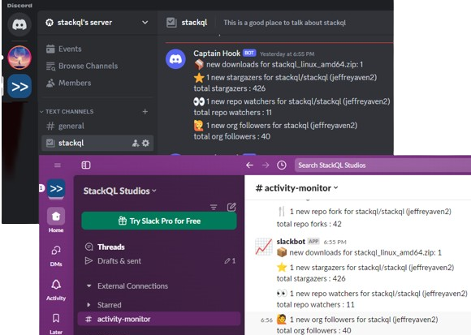
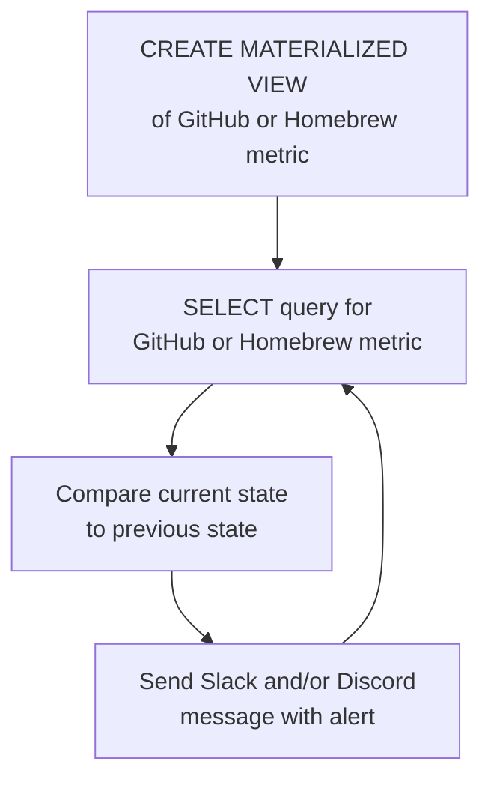

# Open Source Project Activity Monitor

Get real-time alerts in Slack or Discord for GitHub project activity.  



This project uses [__stackql__](https://github.com/stackql/stackql) to perform real-time open source project activity monitoring, this includes real time notification of:

- ⭐ new GitHub repo stargazers
- 👀 new GitHub repo watchers
- 🍴 new GitHub repo forks
- 📊 new GitHub repo issues
- 🙋 new GitHub org followers
- 📦 new GitHub release asset downloads
- 🍺 new homebrew downloads

## How it works

Materialized views and `SELECT` statements are used to capture and compare state between current and previous metrics for GitHub and Homebrew monitored endpoints, this is described in the diagram here:  


for example, here given this materialized view created and populated using `stackql`:  

```sql
CREATE OR REPLACE MATERIALIZED VIEW mvw_github_repo_stargazers AS 
SELECT login FROM github.activity.repo_stargazers
WHERE owner = 'your-org' and repo = 'your-repo'
```

the following `stackql` query polls GitHub for new stargazers...

```sql
SELECT c.login
FROM github.activity.repo_stargazers c
LEFT JOIN mvw_github_repo_stargazers mvw
ON c.login = mvw.login
WHERE mvw.login IS NULL
AND c.owner = 'your-org' AND c.repo = 'your-repo'
```

then the state is refreshed using...

```sql
REFRESH MATERIALIZED VIEW mvw_github_repo_stargazers
```

similar patterns are repeated for repo watchers, issues, org followers, release asset downloads and homebrew downloads.

## Deployment

basic configuration required (provided using environment variables, a `.env` file in the example below):  

| Variable                   | Description                                                                       | Example Value                                    |
|----------------------------|-----------------------------------------------------------------------------------|--------------------------------------------------|
| `LOG_LEVEL`                | Log level (INFO for general logs; DEBUG for detailed logging)                     | INFO                                             |
| `SLEEP_INTERVAL`           | Time delay in seconds between request loops                                       | 5                                                |
| `GITHUB_REPO`              | GitHub repository name                                                            | stackql                                          |
| `GITHUB_REPO_OWNER`        | GitHub organization or owner name                                                 | stackql                                          |
| `HOMEBREW_FORMULA_NAME`    | Homebrew formula name, if available                                               | stackql                                          |
| `STACKQL_GITHUB_USERNAME`  | Your GitHub username                                                              | jeffreyaven                                      |
| `STACKQL_GITHUB_PASSWORD`  | Your GitHub personal access token                                                 | ghp_yourpersonalaccesstoken                      |
| `SLACK_WEBHOOK_URL`        | Slack webhook URL for sending notifications                                       | https://hooks.slack.com/services/...             |
| `DISCORD_WEBHOOK_URL`      | Discord webhook URL for sending notifications                                     | https://discord.com/api/webhooks/...             |

### Build and run locally using `docker`

To build and run the container locally using `docker` run the following commands:
```bash
docker build --no-cache -t oss-activity-monitor .
# to supply the above variables in a .env file
docker run --env-file .env oss-activity-monitor
```
> to stop the container use `docker stop $(docker ps -a -q --filter ancestor=oss-activity-monitor)`

### Run locally using `docker` from image in Dockerhub

To run the container using the image hosted on [Docker Hub](https://hub.docker.com/repository/docker/stackql/oss-activity-monitor/general), execute the following command:

```bash
docker run --env-file .env stackql/oss-activity-monitor:latest
```

> to stop the container use `docker stop $(docker ps -q --filter ancestor=stackql/oss-activity-monitor:latest)`

### Run in Azure Container Instances

To run Azure Container Instances, first, build and push an image to your Azure Container Registry (ACR) using the following commands:

```bash
docker build -t oss-activity-monitor .
docker tag oss-activity-monitor {replace-with-your-acr-name}.azurecr.io/oss-activity-monitor:latest
docker push {replace-with-your-acr-name}.azurecr.io/oss-activity-monitor:latest
```

Replace `{replace-with-your-acr-name}` with the name of your Azure Container Registry.

Then, you can deploy the container instance using the `az` command-line tool, the following example exports container logs to an Azure Log Analytics workspace for inspection:

```bash
# replace with your variables....
RESOURCE_GROUP="oss-activity-monitor-rg-prd"
LOCATION="eastus"
CONTAINER_NAME="activity-monitor-instance"
ACR_NAME="ossactivitymonitorprd"
STORAGE_ACCOUNT_NAME="ossactivitymonitorprd"
IMAGE_NAME="$ACR_NAME.azurecr.io/activity-monitor:latest"
ACR_USERNAME=ossactivitymonitorprd
ACR_PASSWORD=xxxxxx
LOG_ANALYTICS_WORKSPACE_NAME="activity-monitor-logs-prd"
FILE_SHARE_NAME=fileshareprd
MOUNT_PATH=/mnt/azure

# Read .env file and prepare environment variables for ACI
ENV_VARS=()
while IFS='=' read -r key value; do
    ENV_VARS+=("$key=$value")
done < .env

# create a Log Analytics workspace
az monitor log-analytics workspace create \
--resource-group $RESOURCE_GROUP \
--workspace-name $LOG_ANALYTICS_WORKSPACE_NAME \
--location $LOCATION

# get the workspace key
LOG_ANALYTICS_WORKSPACE_KEY=$(az monitor log-analytics workspace get-shared-keys \
--resource-group $RESOURCE_GROUP \
--workspace-name $LOG_ANALYTICS_WORKSPACE_NAME \
--query primarySharedKey -o tsv)
# get the Workspace ID
LOG_ANALYTICS_WORKSPACE_ID=$(az monitor log-analytics workspace show --resource-group $RESOURCE_GROUP --workspace-name $LOG_ANALYTICS_WORKSPACE_NAME --query "customerId" -o tsv)

STORAGE_KEY=$(az storage account keys list \
--resource-group $RESOURCE_GROUP \
--account-name $STORAGE_ACCOUNT_NAME \
--query "[0].value" -o tsv)

# Create a file share
az storage share create \
--account-name $STORAGE_ACCOUNT_NAME \
--name $FILE_SHARE_NAME

# add backend storage variable
BACKEND_FILE_STORAGE_LOCATION="$MOUNT_PATH/stackql.db"
ENV_VARS+=("BACKEND_FILE_STORAGE_LOCATION=$BACKEND_FILE_STORAGE_LOCATION")

# create the container instance
az container create \
--resource-group $RESOURCE_GROUP \
--name $CONTAINER_NAME \
--image $IMAGE_NAME \
--registry-login-server $ACR_NAME.azurecr.io \
--registry-username $ACR_USERNAME \
--registry-password $ACR_PASSWORD \
--environment-variables "${ENV_VARS[@]}" \
--log-analytics-workspace "$LOG_ANALYTICS_WORKSPACE_ID" \
--log-analytics-workspace-key $LOG_ANALYTICS_WORKSPACE_KEY \
--azure-file-volume-account-name $STORAGE_ACCOUNT_NAME \
--azure-file-volume-account-key $STORAGE_KEY \
--azure-file-volume-share-name $FILE_SHARE_NAME \
--azure-file-volume-mount-path $MOUNT_PATH
```

az container create \
--resource-group $RESOURCE_GROUP \
--name $CONTAINER_NAME \
--image stackql/oss-activity-monitor \
--environment-variables "${ENV_VARS[@]}" \
--log-analytics-workspace "$LOG_ANALYTICS_WORKSPACE_ID" \
--log-analytics-workspace-key $LOG_ANALYTICS_WORKSPACE_KEY \
--azure-file-volume-account-name $STORAGE_ACCOUNT_NAME \
--azure-file-volume-account-key $STORAGE_KEY \
--azure-file-volume-share-name $FILE_SHARE_NAME \
--azure-file-volume-mount-path $MOUNT_PATH


az container list \
--resource-group $RESOURCE_GROUP \